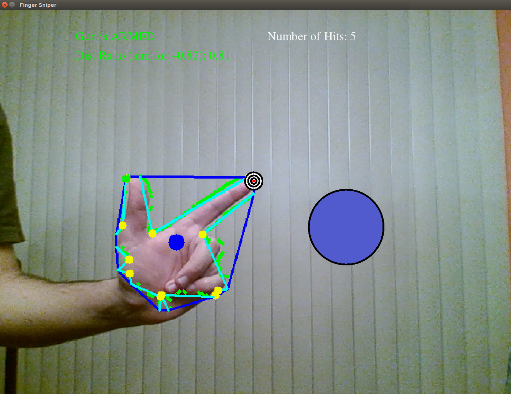

# Finger Sniper

## Contributors

This game was created by Solomon Wiznitzer and Michael Wiznitzer as a final project for EECS 332: Introduction to Computer Vision at Northwestern University.

## Description

**Objective:** To use one's finger as a gun to shoot a moving ball on a screen as many times as possible.

**How It Works:** The camera tracks the tip of the index finger and displays a small target on the screet at the fingertip's position. The gun is armed when the index finger and the thumb are held at right angles to each other. When the player presses their thumb on top of the index finger, the gun is considered fired. Each time the ball is hit (i.e. the target representing the fingertip lies on top of the moving ball), it changes color and the player recieves a point. However, every time the ball hits the edge of the camera frame, it shrinks in size, presenting a smaller target. Once it gets too small, the game is over.

**Dependencies:** Requires the OpenCV and Pygame libraries

**Game Play:** To play the game, clone the repo and type `python fingersniper.py` in the terminal window.

## Technical Overview

### Calibration

At program startup, the figure below appears.

Carefully orient your hand so that it completely fills the interior of the green box. Then press the `b` key. This allows the program to obtain a skin sample that will be used in the color segmentation process (in the HSV color-space). Based on the hue and saturation histograms generated from the sample, the program creates a mask that should allow the hand to be seen by the camera but not much of anything else. To reduce noise, Gaussian blurring along with morphological operations (dilation & erosion) are performed on the image.

#### Tracking and Gesture Detection

Using OpenCV's `cv2.findContours` function to find the outline of the hand (green color in the image below), the centroid can be calculated (small blue circle). Next, the `cv2.convexHull` function can be implemented to find the shape representing the outer boundary of the hand (shown in blue). Then, with the `cv2.convexityDefects` function, the local maximum deviations from the hull can be determined (shown in yellow). Finally, the defect that is the furthest away from the centroid is assumed to be the index fingertip while the the second furthest is assumed to be the thumb tip (green dot).

In the armed state, the ratio of the distances from the centroid to the thumb tip and fintertip should be between 0.79 and 0.86. If it is, a message (like the one above) will appear in green saying that the gun is armed. If the gun is being held in the armed configuration but the ratio is off, a message will appear in red saying that the gun is not armed. To fix this, adjust your hand so that it is centered in the image. When you shoot, the ratio should change to be between 0.7 and 0.79 and a red 'unarmed' message will appear. If the gun tip is on the ball, a hit will be recorded. That said, automatic shooting is disabled so don't think you can just keep your hand in a shooting position!
